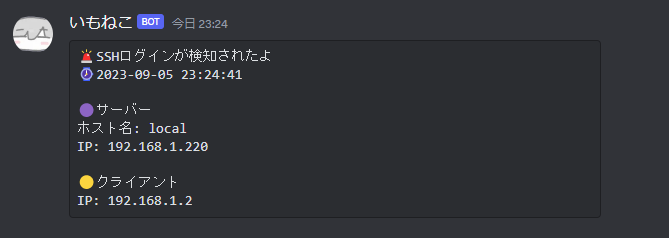
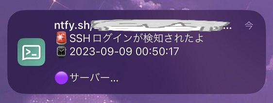
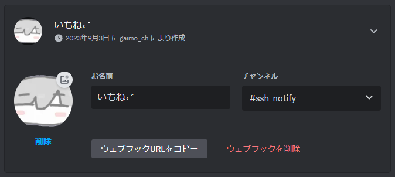
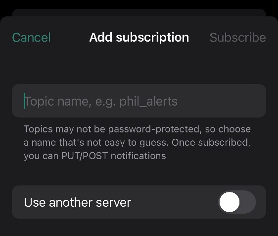

<h1 align="center">
  🚨 SSH-Notify
</h1>

<p align="center">
  <b>
    Linuxサーバに対するSSH接続をPAMを用いて検知して通知をおこなうよ
  <br>
  Discord / ntfy
  <br>
  Python 3.10.12 / Ubuntu 22.04.3
  </b>
</p>

<p align="center">
  
  
</p>

---

# 🛠 準備をしよう

## Discordを使用する場合

適当なDiscordサーバを立て、Webhookを作成、URLをコード内に貼り付けよう。<br>
サーバー設定 → 連携サービス → ウェブフック



## [ntfy.sh](https://ntfy.sh)を使用する場合

AndroidやiPhoneなどに対してコマンドラインからcurlなどで通知を飛ばすことができるよ。<br>

**ntfy.sh公式サーバーを経由するため、同じトピック名を設定した人にも通知が飛びます‼️**<br>
なので乱数を設定した方がいいかも。設定したトピック名をPythonコード内に貼り付けてね。



## Linux

PythonファイルをLinuxサーバ内の適当な場所に配置しよう。<br>
netifaces, requestsライブラリを使用するため、事前に`pip install`しておこう。

SSHのアクセスログからクライアントのIPアドレスを取得するよ。各ディストリビューションごとに認証ログのパスが違うため、編集する必要があるかも。<br>
本コードでは`/var/log/auth.log`を指定しているよ。

PAMはLinuxで使用される認証システムで、これを用いてSSH接続を検知し、Pythonスクリプトを実行するよ。<br>
root権限で`/etc/pam.d/sshd`に以下の記述を追記しよう。パスは各自変更してね。

```sh
session optional pam_exec.so type=open_session /path/to/dir/ssh-notify.py
```

# ✅ 試してみよう

SSH接続を行うと、通知が...‼️ やったね🎉<br>
コード内に特定のIPを除外する記述もあるから、お好みの設定をしてね。<br>
ens18をNIC名に指定していますが、環境に合わせて変更してね。